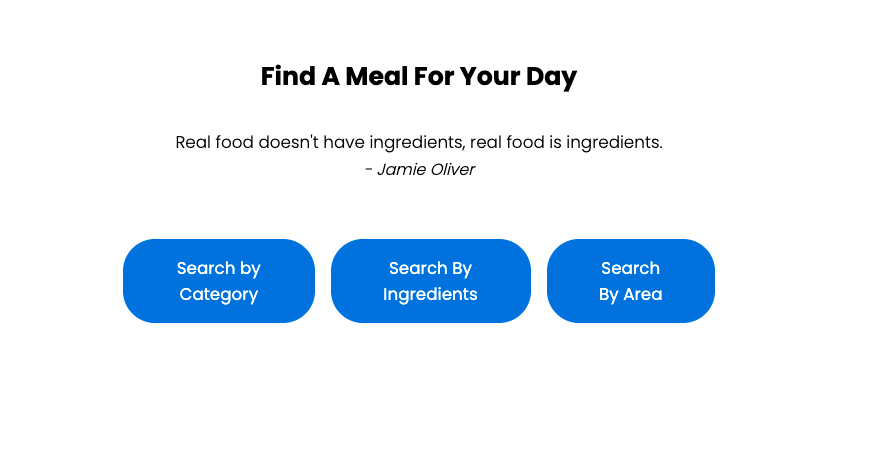
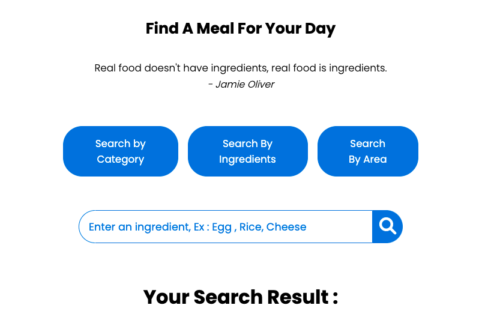
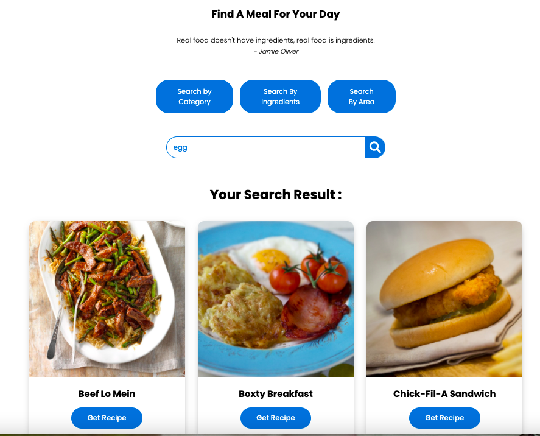
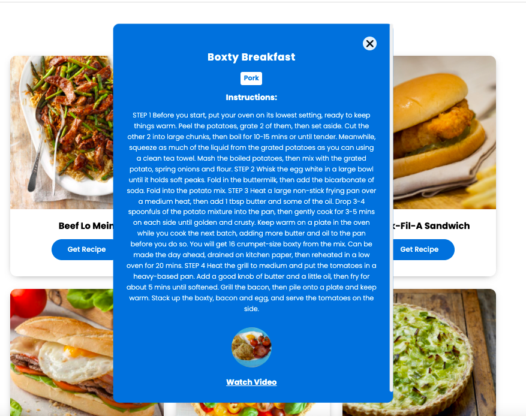

# Find Meal APP 
Find-A-Meal is an application that allows customers to search food and meals they like based on their references .

## Description

We can find differnt type of meals like (Italian, Asian, French etc.)

- We can search meals based on categories ( Example : Seafood, Beef, Breakfast, etc )
- We can brouse meals based on ingredients ( Example : Egg, Bread, Beans, etc )
- We can brouse meals based on Area ( Example : American, Canadian, Dutch, etc )
- We can also get meals details such as name, Instructions, Youtube link.
- We can learn how to make different types of food.

## APP ScreenShots

### Home Page

### Search Page

### Result Page

### detail Page

## Built With
- HTML
- CSS
- Fontawesome
- JavaScript
- 
## Live Demo
- URL: https://radhi-hudijan.github.io/Find-Meal-APP/index.html

## Developed By
#### 👤 **RADHI HUDIJAN**

- Github: [@Radhi-Hudijan](https://github.com/Radhi-Hudijan)
- Linkedin: [Radhi hudijan](https://linkedin.com/in/radhi-hudijan-094b8072)
- Email: radhif2009@gmail.com

